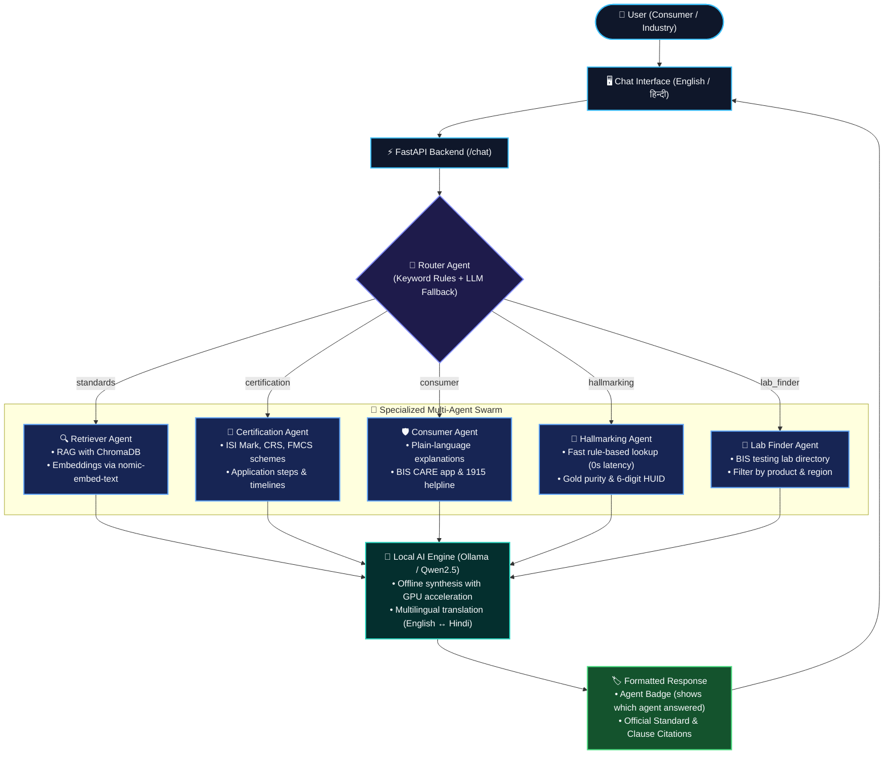

# ComplyBot — AI Assistant for Indian Standards & BIS Services
### SIH26107 / Infothon 7.0 PS #04

A multi-agent conversational assistant covering BIS standards lookup, certification
guidance, hallmarking, lab recommendations, and multilingual (EN/HI) consumer and
industry queries — running entirely **locally** using your GPU via Ollama, so there
are no API costs and no internet dependency during your demo.

## 🏗️ System Architecture & Workflow



### 🔄 How the Pipeline Works:

1. **Query & Language Ingestion**: User enters a query via the chat UI in English or Hindi.
2. **Deterministic & Fallback Routing**: The **Router Agent** inspects query keywords. If matched, it instantaneously routes to the designated agent without LLM latency. For ambiguous queries, it falls back to an LLM intent classifier.
3. **Domain Specialist Execution**:
   - **Retriever Agent (RAG)**: Generates vector embeddings using `nomic-embed-text`, performs cosine similarity search on **ChromaDB**, and provides verified standard clauses to `Qwen2.5` to synthesize an answer with exact citations.
   - **Certification Agent**: Matches products against structured BIS schemes (`certification_schemes.json`) and details exact application steps and timelines.
   - **Consumer Agent**: Formulates clear, simplified guidance with direct references to the BIS CARE app and National Consumer Helpline (1915).
   - **Hallmarking Agent**: **Pure rule-based execution** over `hallmarking_rules.json` to verify gold purity (24K, 22K, 18K, 14K) and 6-digit alphanumeric HUID format instantly with 0 LLM latency.
   - **Lab Finder Agent**: Searches `labs.json` to recommend nearest BIS-recognized testing laboratories.
4. **Multilingual Translation Layer**: Translates answers to Hindi seamlessly via `Qwen2.5` if selected or detected.
5. **Transparency Badge & Citations**: Every response returns an explicit **"Answered by: [Agent Name]"** badge and verifiable document citations.

## Prerequisites

1. **Install Ollama** (if you don't already have it): https://ollama.com/download
   - Windows/Mac/Linux installers are all available on that page.
   - After installing, confirm it works: open a terminal and run `ollama --version`

2. **Pull the two models this project uses:**
   ```bash
   ollama pull nomic-embed-text
   ollama pull qwen2.5:7b-instruct
   ```
   `qwen2.5:7b-instruct` was chosen because it has solid Hindi support and fits
   comfortably on a 6–8GB VRAM GPU (RTX 3050/3060-class) at default quantization.

   **If your GPU struggles / responses are slow**, swap to a smaller model:
   ```bash
   ollama pull qwen2.5:3b-instruct
   ```
   Then change `CHAT_MODEL = "qwen2.5:7b-instruct"` to `"qwen2.5:3b-instruct"`
   in `backend/agents.py`.

3. **Python 3.10+** installed.

## Setup

```bash
cd backend
pip install -r requirements.txt
```

## Build the knowledge base (run once, and again after editing data/standards/*.md)

```bash
cd backend
python ingest.py
```

You should see it embed each chunk and confirm it was stored in ChromaDB.

## Run the app

You can run the app with **npm** or terminal shortcuts (browser will open automatically):
```bash
npm start
# or
npm run st
# or directly on Windows terminal:
st
```

Or directly with **Python**:
```bash
python run.py
```
*(Your default web browser will automatically open `http://localhost:8000` once the server is ready).*

## Demo script (matches the plan we discussed)

1. Click the **"LED certification (industry)"** example button — shows the
   Certification & Licensing Agent explaining the CRS scheme with citations.
2. Switch language to **हिं (Hindi)**, click **"Verify hallmark (consumer, Hindi)"**
   — shows the Hallmarking Agent responding in Hindi.
3. Click **"Find a testing lab"** — shows the Lab Finder Agent listing relevant labs.
4. Point out the **"Answered by: ..."** badge, **Confidence Rating (%)**, and verifiable source citations on each response.
5. Log in or create an account via the sidebar footer to save threads across sessions.

## 🚀 System Evolution: Phase 1, Phase 2 & Phase 3 (Completed)

### Phase 1 — Foundation & Authentication
- **Persistent SQLite Database (`database.py`)**: Stores users, conversations, messages, and uploaded documents.
- **User Authentication & Profiles (`auth.py`)**: Secure bcrypt password hashing and JWT bearer tokens (`/register`, `/login`, `/me`).
- **Multi-Turn Conversation Memory**: Preserves context across conversation turns by injecting recent message history into LLM prompts.
- **Answer Confidence Scoring**: Computes vector similarity alignment and displays color-coded confidence badges (`96% Confidence`), with safety warnings for low-confidence queries.

### Phase 2 — Core Compliance Product Features
- **Compliance Checklist Generator Agent**: Provides structured regulatory roadmaps for product categories (standards, routes, markings, testing, documents, timeline, and cost).
- **Compare Mode Agent**: Side-by-side comparative analysis of regulatory requirements across product classes (e.g., LED lamps vs electric fans) rendered as interactive comparison tables.
- **Product Label & Certificate OCR Audit (`POST /upload`)**: Upload product photos, packaging labels, or certificates to automatically audit against official BIS statutory markings (ISI logo, CM/L number, CRS R-Number, and HUID).
- **Filterable Lab Directory (`GET /labs`)**: Search and filter BIS-recognized testing laboratories by state, testing category, NABL accreditation, and global export certification.
- **Evidence Provenance ("Why this answer?")**: Every response features source provenance metadata explaining how the multi-agent swarm derived the answer.

### Phase 3 — Enterprise Governance, PDF Reports & Master Catalog
- **Executive PDF & Printable HTML Reports (`/report/pdf`, `/report/html`)**: Generates formal, publication-quality BIS statutory compliance assessment reports in downloadable PDF and printable HTML formats with one click.
- **Admin Dashboard & Analytics Portal (`/admin`, `frontend/admin.html`)**: Real-time operational analytics dashboard featuring query volume, swarm agent distribution, low-confidence review queue, and active standards corpus status.
- **Authoritative BIS Master Standards Catalog (`data/standards_catalog.json`)**: Curated repository of 25+ mandatory Quality Control Orders (QCOs) spanning automotive helmets, cosmetics, steel, cement, batteries, solar panels, footwear, and cookware to guarantee zero-hallucination answers even when raw documents are not pre-indexed in vector storage.
- **Standards File Upload & One-Click Vector Re-Indexing (`POST /admin/reingest`)**: Administrators can upload new markdown standard files directly through the UI and trigger ChromaDB vector re-embedding with live feedback.
- **Hinglish & Natural Dialect Conversational Support**: Router and specialist agents natively handle Hinglish keywords and mixed-code queries (*"helmet ka standard kya hai"*, *"sona purity kaise check kare"*, *"nakli samaan complaint"*, *"lab kahan milega"*).

