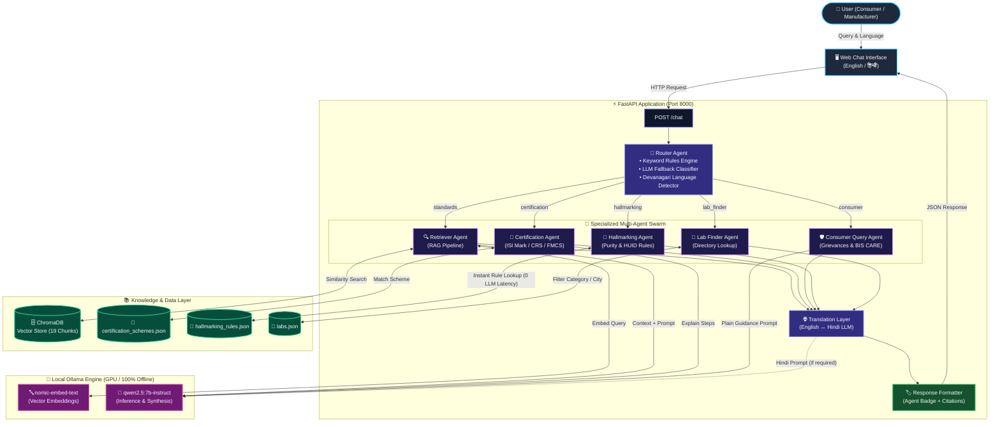

# ComplyBot — AI Assistant for Indian Standards & BIS Services
### SIH26107 / Infothon 7.0 PS #04

A multi-agent conversational assistant covering BIS standards lookup, certification
guidance, hallmarking, lab recommendations, and multilingual (EN/HI) consumer and
industry queries — running entirely **locally** using your GPU via Ollama, so there
are no API costs and no internet dependency during your demo.

## 🏗️ System Architecture & Workflow



### 🔄 How the Pipeline Works:

1. **Query & Language Ingestion**: User enters a query via the chat UI in English or Hindi.
2. **Deterministic & Fallback Routing**: The **Router Agent** inspects query keywords. If matched, it instantaneously routes to the designated agent without LLM latency. For ambiguous queries, it falls back to an LLM intent classifier.
3. **Domain Specialist Execution**:
   - **Retriever Agent (RAG)**: Generates vector embeddings using `nomic-embed-text`, performs cosine similarity search on **ChromaDB**, and provides verified standard clauses to `Qwen2.5` to synthesize an answer with exact citations.
   - **Certification Agent**: Matches products against structured BIS schemes (`certification_schemes.json`) and details exact application steps and timelines.
   - **Consumer Agent**: Formulates clear, simplified guidance with direct references to the BIS CARE app and National Consumer Helpline (1915).
   - **Hallmarking Agent**: **Pure rule-based execution** over `hallmarking_rules.json` to verify gold purity (24K, 22K, 18K, 14K) and 6-digit alphanumeric HUID format instantly with 0 LLM latency.
   - **Lab Finder Agent**: Searches `labs.json` to recommend nearest BIS-recognized testing laboratories.
4. **Multilingual Translation Layer**: Translates answers to Hindi seamlessly via `Qwen2.5` if selected or detected.
5. **Transparency Badge & Citations**: Every response returns an explicit **"Answered by: [Agent Name]"** badge and verifiable document citations.

## Prerequisites

1. **Install Ollama** (if you don't already have it): https://ollama.com/download
   - Windows/Mac/Linux installers are all available on that page.
   - After installing, confirm it works: open a terminal and run `ollama --version`

2. **Pull the two models this project uses:**
   ```bash
   ollama pull nomic-embed-text
   ollama pull qwen2.5:7b-instruct
   ```
   `qwen2.5:7b-instruct` was chosen because it has solid Hindi support and fits
   comfortably on a 6–8GB VRAM GPU (RTX 3050/3060-class) at default quantization.

   **If your GPU struggles / responses are slow**, swap to a smaller model:
   ```bash
   ollama pull qwen2.5:3b-instruct
   ```
   Then change `CHAT_MODEL = "qwen2.5:7b-instruct"` to `"qwen2.5:3b-instruct"`
   in `backend/agents.py`.

3. **Python 3.10+** installed.

## Setup

```bash
cd backend
pip install -r requirements.txt
```

## Build the knowledge base (run once, and again after editing data/standards/*.md)

```bash
cd backend
python ingest.py
```

You should see it embed each chunk and confirm it was stored in ChromaDB.

## Run the app

```bash
cd backend
uvicorn main:app --reload --port 8000
```

Then open **http://localhost:8000** in your browser. The frontend is served
directly by the backend, so this one URL is all you need.

## Demo script (matches the plan we discussed)

1. Click the **"LED certification (industry)"** example button — shows the
   Certification & Licensing Agent explaining the CRS scheme with citations.
2. Switch language to **हिं (Hindi)**, click **"Verify hallmark (consumer, Hindi)"**
   — shows the Hallmarking Agent responding in Hindi.
3. Click **"Find a testing lab"** — shows the Lab Finder Agent listing relevant labs.
4. Point out the **"Answered by: ..."** badge on each response — this is the
   visual proof of the multi-agent architecture for judges.

## What's real vs. what's scoped down for the hackathon

- **Real**: local LLM inference via Ollama, real vector embeddings + similarity
  search via ChromaDB, real multi-agent routing logic, real Hindi translation.
- **Scoped down (clearly labeled in the code/data)**: the standards corpus is a
  small set of **original, illustrative knowledge-base articles** (3 product
  categories) rather than the full BIS standards library — real IS standard
  documents are copyrighted and licensed by BIS, so for a hackathon demo you
  write your own accurate summaries instead of reproducing official text
  verbatim. The lab directory in `data/labs.json` is sample data, clearly
  marked as such — swap in the real BIS-recognized lab list for production use.

## Extending this later

- Add more `.md` files to `data/standards/` and re-run `ingest.py` to grow the
  corpus (toys, electricals, and food/water are covered now — add textiles,
  cosmetics, etc.)
- Add more languages to the `translate()` function in `agents.py`
- Swap the keyword-based Router for a fully LLM-based classifier once you've
  validated it's reliable enough (keyword-first was chosen for demo reliability)
- Add a login + consumer complaint-filing flow (out of scope for this MVP per
  the implementation plan)
