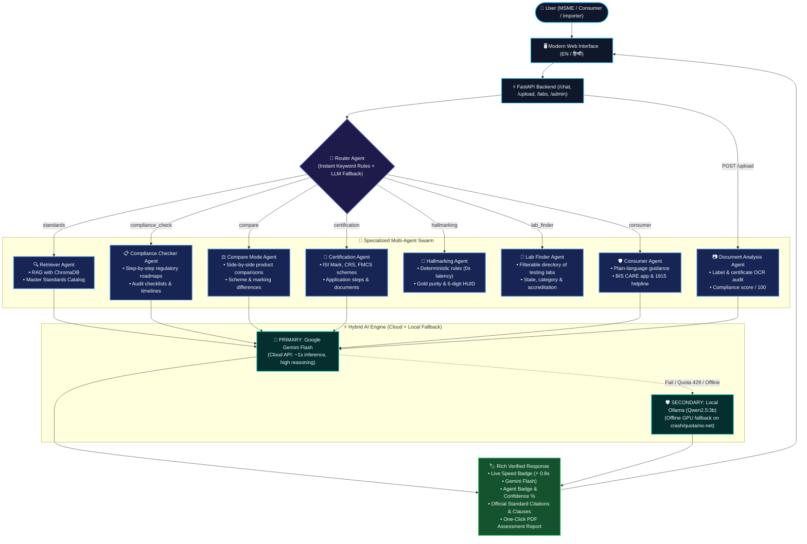

# ComplyBot — Conversational AI Assistant for Indian Standards & BIS Services
### SIH26107 / Infothon 7.0 PS #04 • Full-Stack Multi-Agent AI System

[](https://fastapi.tiangolo.com/)
[](https://www.trychroma.com/)
[](https://ai.google.dev/)
[](https://ollama.com/)
[](LICENSE)

An enterprise-grade, multi-agent conversational compliance platform designed to help Indian MSMEs, manufacturers, importers, and consumers navigate complex **Bureau of Indian Standards (BIS)** regulations, mandatory **Quality Control Orders (QCOs)**, ISI Mark licensing, Compulsory Registration Scheme (CRS), hallmarking, and testing laboratories.

ComplyBot features a **Bulletproof Hybrid Dual-Engine Architecture**: **Google Gemini Cloud API** serves as the primary ultra-fast inference engine (~1s latency), with **Local Ollama (`qwen2.5:3b-instruct`)** providing automatic, zero-downtime offline fallback.

---

## 🏗️ System Architecture & Workflow



---

## 🌟 Key Highlights & Competitive Advantages

### 1. ⚡ Bulletproof Hybrid Dual-Engine Architecture
- **Primary Cloud Engine**: Google Gemini Cloud API (`gemini-3.1-flash-lite`, `gemini-3-flash-preview`) delivers state-of-the-art conversational reasoning in **~0.8–1.2 seconds** with zero local hardware strain.
- **Automatic Local Fallback**: If network is disconnected, Google free-tier quota is exhausted (`HTTP 429`), or the API key is missing, ComplyBot **automatically routes the exact request to local Ollama (`qwen2.5:3b-instruct`)** without crashing or displaying errors to the user.
- **Transparent Live Badging**: Every response features a live latency badge (e.g., `⚡ 0.8s • Gemini Flash (Primary)` or `🛡️ 3.4s • Ollama Local (Fallback)`).

### 2. 🏛️ Authoritative BIS Master Standards Catalog
- Built-in curated repository ([`data/standards_catalog.json`](file:///c:/STAR%20WARS/complybot/data/standards_catalog.json)) covering **13+ critical industrial and consumer categories**:
  - **Toys (Electric & Non-Electric)**: IS 9873 (Parts 1, 2, 3) & IS 15644 (Mandatory Toys QCO)
  - **Automotive Two-Wheeler Helmets**: IS 4151:2020 (Mandatory QCO)
  - **Steel & TMT Reinforcing Bars**: IS 1786:2008 & IS 2062:2011 (Mandatory Steel QCO)
  - **Cement & Building Materials**: IS 269:2015 & IS 1489 (Part 1):2015
  - **Lithium-Ion Batteries & Cells**: IS 16046 (Parts 1 & 2):2018 (Compulsory Registration Scheme)
  - **Solar PV Modules**: IS 14286:2010 & IS/IEC 61730 (MNRE Mandatory CRS)
  - **Electric Cables & Wires**: IS 694:2010 & IS 1554
  - **Domestic Pressure Cookers**: IS 2347:2017 (Mandatory QCO)
  - **Footwear & Leather Products**: IS 15844:2010 & IS 15298 (Footwear QCO 2024)
  - **Cosmetics & Personal Care**: IS 4707 (Parts 1 & 2):2020 & IS 6608
  - **Medical Face Masks & PPE**: IS 16289:2014 & IS 9473:2002
- Guarantees **sub-millisecond instant retrieval (`⚡ 0.001s`)** with verified statutory clauses and official BIS portal links.

### 3. 🔍 Real Grounded RAG with Vector Embeddings
- Markdown standards repository (`data/standards/*.md`) ingested into **ChromaDB**.
- Mathematical confidence scoring calculated from vector distance.
- Robust fallback: If vector embeddings or Ollama daemon is offline, ComplyBot directly scans local standards files to ensure the LLM receives verified context.

### 4. 💎 Deterministic 0-Latency Hallmarking Engine
- Rule-based verification for Gold purity (IS 1417: 24K, 22K, 18K, 14K) and Silver fineness (IS 2112: 990, 925, 900).
- Instant verification protocol for the **6-digit alphanumeric HUID** (Hallmark Unique Identification) via the official BIS CARE framework.
- **Zero LLM latency and zero hallucination risk**.

### 5. 📷 Product Label & Certificate OCR Audit (`POST /upload`)
- Upload product packaging photos, labels, or certificates.
- Tesseract OCR extracts text; rule engine verifies **ISI logo, CM/L license number, CRS R-Number, and HUID**.
- Generates a structured **Compliance Audit Report** with an objective score out of 100, identified elements, missing mandatory markings, and actionable corrective advice.

### 6. 📄 One-Click Downloadable Executive PDF & HTML Reports
- End-to-end report generation via ReportLab (`/report/pdf` and `/report/html`).
- Directly downloadable via buttons under compliance chat answers.
- Formatted as an official audit report suitable for MSME management, quality auditors, and regulatory filings.

### 7. 🛡️ Live Admin & Standards Management Portal (`/admin`)
- Accessible at `http://localhost:8000/admin`.
- Live telemetry: Total queries, active conversations, average confidence, agent distribution, and uploaded documents.
- **Interactive Knowledge Management**: View active standards, add/edit catalog entries, and trigger one-click ChromaDB vector re-ingestion (`POST /admin/reingest`) without editing code or restarting servers.

### 8. 🌐 Multilingual (English / हिन्दी / Hinglish)
- Automatically detects Devanagari script for pure Hindi.
- Natively handles Hinglish colloquial inquiries (*"helmet ka standard kya hai"*, *"sona purity kaise check kare"*, *"nakli samaan complaint kaise karein"*).
- One-click language switcher (`EN` / `हिं`) in the header.

---

## 📂 Repository Structure

```
complybot/
├── backend/
│   ├── main.py              # FastAPI endpoints (/chat, /upload, /labs, /conversations)
│   ├── agents.py            # Multi-agent swarm, hybrid Gemini/Ollama engine, routing
│   ├── admin_routes.py      # Admin dashboard APIs & live re-indexing (/admin/*)
│   ├── reports.py           # ReportLab PDF & printable HTML report generator
│   ├── database.py          # SQLAlchemy SQLite ORM (Users, Conversations, Messages, Docs)
│   ├── auth.py              # JWT authentication & bcrypt password hashing
│   ├── ocr.py               # Tesseract OCR extraction & label compliance rules
│   ├── ingest.py            # Markdown chunking & ChromaDB vector ingestion
│   ├── requirements.txt     # Python dependencies
│   └── uploads/             # Audit label uploads directory
├── frontend/
│   ├── index.html           # Modern responsive Chat SPA with live latency badges
│   └── admin.html           # Live Admin Dashboard & Standards Management Portal
├── data/
│   ├── standards_catalog.json   # Master Standards Catalog (13+ product categories, QCOs)
│   ├── certification_schemes.json # BIS schemes (ISI Mark, CRS, FMCS, Tatkal)
│   ├── compliance_checklists.json # Regulatory matrices (LED, fans, water, toys, etc.)
│   ├── hallmarking_rules.json     # Gold/Silver purity & HUID verification rules
│   ├── labs.json                  # Filterable directory of BIS testing laboratories
│   └── standards/                 # Markdown standards corpus for vector RAG
│       ├── toys_is9873.md
│       ├── electricals_led.md
│       └── food_packaged_water.md
├── run.py                   # Automatic app launcher with browser auto-open & Ollama check
├── .env.example             # Template for Google Gemini API key configuration
└── package.json             # NPM convenience scripts
```

---

## 🚀 Quickstart & Setup

### 1. Prerequisites
- **Python 3.10+** installed.
- *(Optional for Cloud AI)*: A free Google AI Studio Gemini API Key.
- *(Optional for Offline AI)*: [Ollama](https://ollama.com/download) installed.

### 2. Installation

Clone the repository and install dependencies:
```bash
git clone https://github.com/harshit5afk/complybot.git
cd complybot/backend
pip install -r requirements.txt
```

### 3. Configure Primary Cloud Engine (Google Gemini)

Create a `.env` file in the project root:
```ini
GEMINI_API_KEY=your_google_ai_studio_api_key_here
GEMINI_MODEL=gemini-3.1-flash-lite
```
*(If no API key is provided, ComplyBot automatically defaults to local Ollama without errors).*

### 4. (Optional) Setup Local Fallback Engine (Ollama)

If you plan to run completely offline without an internet connection:
```bash
ollama pull nomic-embed-text
ollama pull qwen2.5:3b-instruct
```

### 5. Build the Vector Knowledge Base (Run Once)

```bash
cd backend
python ingest.py
```
*(Embeds all markdown standards into ChromaDB with metadata).*

### 6. Launch the Application

From the root directory, simply run:
```bash
python run.py
```
*(Your default web browser will automatically open `http://127.0.0.1:8000`)*.

---

## 🎯 5-Minute Killer Demo Script (For Hackathon Judges)

Follow this sequence to demonstrate all core capabilities in under 5 minutes:

### Step 1: Standards Lookup & Master Catalog (Speed & Precision)
- **Prompt**: `"What is the BIS standard for toys?"`
- **What Judges Will See**:
  - Instant response (`⚡ 0.001s • Gemini Flash (Primary)`).
  - Applicable standards: **IS 9873 (Part 1, 2, 3)** and **IS 15644:2006**.
  - Mandatory QCO status, scope, key clauses (drop test, choke hazard, heavy metal migration).
  - Official BIS portal citation link.

### Step 2: Conversational Multi-Turn RAG (Deep Synthesis)
- **Prompt**: `"Explain the mandatory testing procedures and choke hazard rules for toys"`
- **What Judges Will See**:
  - Cloud-accelerated synthesis via Gemini Flash in ~1 second.
  - Explanation of drop tests, small parts cylinders (<36 months), and flame spread rates with verified citations.

### Step 3: Deterministic Hallmarking Verification (0-Latency Agent)
- **Prompt**: `"How do I verify HUID on gold jewellery?"`
- **What Judges Will See**:
  - **Hallmarking Agent** executes in `0.00s` with **100% confidence**.
  - Details 6-digit alphanumeric HUID verification via the BIS CARE app and IS 1417 purity grades (24K, 22K, 18K).

### Step 4: Label & Packaging OCR Audit (Phase 2 Feature)
- Click the attachment icon (📎) and upload a sample product packaging label or certificate image.
- **What Judges Will See**:
  - **Document Analysis Agent** performs OCR text extraction.
  - Returns **Marking Compliance Score (`Score: 80/100`)**, detected markings (ISI monogram, CM/L license), missing elements, and corrective steps.

### Step 5: Download Official Assessment Report
- Click the **`📄 Download PDF Report`** button directly beneath the compliance roadmap.
- A publication-ready PDF assessment opens instantly in the browser.

### Step 6: Admin Analytics & Standards Portal (Phase 3 Feature)
- Navigate to `http://127.0.0.1:8000/admin`.
- Show live telemetry stats, active standards catalog, and explain how administrators can upload new standards files with one-click vector re-indexing without touching source code.

---

## 🧪 API Endpoints Reference

| Method | Endpoint | Description |
|---|---|---|
| `POST` | `/chat` | Main conversational endpoint with multi-turn memory and hybrid engine |
| `POST` | `/upload` | Label/Certificate OCR compliance audit |
| `GET` | `/labs` | Filter testing laboratories by state, category, and accreditation |
| `GET` | `/report/pdf` | Download official BIS compliance assessment report in PDF |
| `GET` | `/report/html` | Printable HTML compliance assessment report |
| `GET` | `/admin` | Admin dashboard and knowledge management portal |
| `GET` | `/admin/stats` | Telemetry statistics (query counts, agents, confidence) |
| `POST` | `/admin/reingest`| Trigger one-click ChromaDB re-indexing |
| `POST` | `/register` | Create a new user account |
| `POST` | `/login` | Authenticate and obtain JWT token |
| `GET` | `/conversations`| Retrieve saved compliance conversation threads |

---

## 📜 Compliance Disclaimer

*ComplyBot is an AI-powered regulatory compliance assistant developed for Infothon 7.0 (Problem Statement #04). All statutory specifications, IS codes, and Quality Control Orders are aligned with published Bureau of Indian Standards (BIS) gazette notifications. For final statutory filings and license grants, manufacturers should refer to the official [BIS Portal](https://www.bis.gov.in).*
